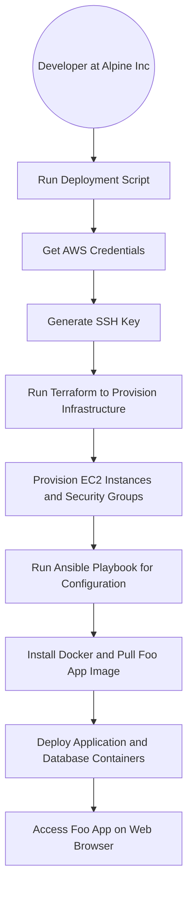
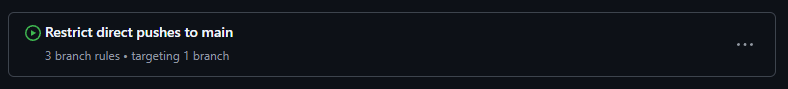
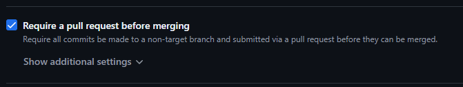
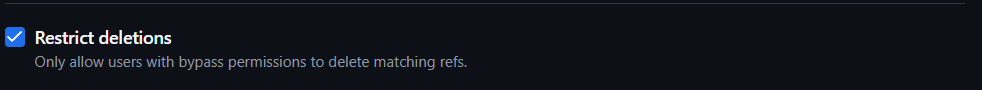
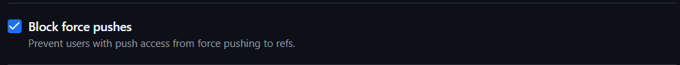

# COSC2759 Assignment 2

## Contributors
- Full Name/Names: George Stergiadis and Kaleb Cole
- Student ID/IDs: s3895662 and s4077402

</br>

## Solution design

### Overview
The solution is designed to deploy a web application called Foo App. The application consists of two Docker containers: a web application and a database. The web application is a web page that displays a list of items from a MySQL database.

The solution is deployed on AWS using Terraform and Ansible amd is spun up using a single script (./multi-instance-deploy.sh) that automates the deployment process. 

The script will prompt the user for their AWS credentials, generate an SSH key pair, provision the infrastructure using Terraform, configure the infrastructure using Ansible, and deploy the application and database containers.

</br>

### Infrastructure

#### Infrastructure Architecture diagram


#### Description of the architecture

1. Shell Script
    - A bash script that automates the necessary steps to deploy the Foo App on AWS.
 
2. Provision infrastructure using Terraform
    - Description of the infrastructure
        - EC2 instances
        - Security group
            - SSH port open to the developer's public IP
            - HTTP port open to the public

3. Configure infrastructure using Ansible
    - Description of the configuration
        - Install Docker
        - Pull Foo App and Foo DB images from Docker Hub
        - Deploy application containers on 2 EC2 instances and database container on 1 EC2 instance

4. Deploy application and database containers
    - Description of the containers
        - Foo App 1
        - Foo App 2
        - Foo DB
    - Description of the deployment
        - The Foo App container is deployed on port 3001
        - The MySQL database container is deployed on port 5432

</br>

### Process Diagram


</br>

### Design Decisions

```yaml
vars:
    ansible_ssh_extra_args: "-o StrictHostKeyChecking=accept-new"
```

db-playbook.yml & app-playbook.yml - This variable accepts all new incoming ssh connections without needing to manually do it to improve automation.

</br>

```yaml
state: started
restart_policy: always
```

db-playbook.yml & app-playbook.yml - These parameters make sure that the containers are running and if they go down then they'll restart.

</br>

```hcl
resource"local_file" "ansible_inventory" {
    filename = "ansible-inventory.yml"
    content = <<-EOF
      app_servers:
        hosts:
          app1:
            ansible_host: ${aws_instance.app_server_1.public_dns}
          app2:
            ansible_host: ${aws_instance.app_server_2.public_dns}
      db_servers:
        hosts:
          ${aws_instance.db_server.public_dns}:
    EOF
}
```

ansible-config.tf - The inventory of hosts for ansible is automatically created with a Terraform config.

</br>

```hcl
data"external" "user_public_ip" {
  program = ["bash", "-c", "echo '{\"ip\": \"'$(curl -s http://checkip.amazonaws.com)'\"}'"]
}
```
```hcl
cidr_blocks = ["${data.external.user_public_ip.result.ip}/32"]
```

main.tf - This is the technique used to fetch the public ip of the user executing the infrastructure build in order to protect the SSH port.

</br>

```bash
set -e

trap 'echo "An error occured. Exiting..."' ERR
```

multi-instance-deploy.sh - A check is implemented where if any error occurs then the script will stop at the point of error and display an error message to the user.

</br>

```bash
echo -e "\nEnter AWS Access Key ID (leave blank for existing creds):"
read AWS_ACCESS_KEY_ID 
```
```bash
if [ -f ~/.aws/credentials ]; then
    EXISTING_ACCESS_KEY_ID=$(grep -oP '(?<=aws_access_key_id=).*' ~/.aws/credentials)
fi
```
```bash
cat <<EOL > ~/.aws/credentials
[default]
aws_access_key_id=$AWS_ACCESS_KEY_ID
EOL
```

multi-instance-deploy.sh - Environment variables are collected and stored in the appropriate cred files. If the user doesn't enter anything then existing creds in the files are used (for illustrative purposes only the AWS_ACCESS_KEY_ID variable is displayed).

</br>

```bash
cd infra

echo "Destroying main infrastructure..."
terraform destroy --auto-approve

cd ../bucket

echo "Destroying s3 bucket..."
terraform destroy --auto-approve
```
destroy-ALL-infrastructure.sh - A shell script that enables quick destruction of all infrastructure to increase efficiency of development.

</br>

```hcl
resource"aws_s3_bucket" "s3_bucket" {
  bucket = "foo-bucket-s3895662-s4077402"
  force_destroy = true
}

resource"aws_s3_bucket_versioning" "versioning" {
  bucket = aws_s3_bucket.s3_bucket.id
  versioning_configuration {
    status = "Enabled"
  }
}

resource"aws_dynamodb_table" "s3_bucket_lock" {
  name           = "foostatelock"
  read_capacity  = 20
  write_capacity = 20
  hash_key       = "LockID"

  attribute {
    name = "LockID"
    type = "S"
  }
}
```

s3-bucket-infra.tf - Creation of an s3 bucket that holds the state file is made with versioning and a lock to stop multiple people from applying changes at the same time. Since the state is stored in the bucket, anyone can fetch the state and use it.

</br>

```hcl
ingress {
    from_port   = 5432
    to_port     = 5432
    protocol    = "tcp"
    security_groups = [aws_security_group.app_security_group.id]
  }
```

main.tf - The security group of the app servers is parsed into the PostgreSQL port so only instances that utilise the app_security_group can access the database.

</br>

```hcl
health_check {
    enabled = true
    matcher = 200
    protocol = "HTTP"
    interval            = 10
    path                = "/"
    timeout             = 3
    healthy_threshold   = 3
    unhealthy_threshold = 2
    port                = 80
  }
```

load-balancer.tf - A health check is enabled on target groups of the load balancer to check whether a target is healthy or unhealthy. The load balancer will route requests only to healthy targets.

</br>

```hcl
access_logs {
    enabled  = true
    bucket  = "foo-bucket-s3895662-s4077402"
    prefix  = "alb"
  }
```

load-balancer.tf - Logs from the load balancer are sent to the s3 bucket in order to view how the load balancer forwards connections to the different targets (instances).

</br>

### Branch Protection

<p> The main branch is protected by the following rules: </p>

<br>
1. Require pull request reviews before merging
<br>

<br>
2. Restrict Deletions to the main branch

<br>
3. Block force push to the main branch
<br>


</br></br>

### Deployment process

#### Prerequisites

1. You will need to have an AWS account. You can create one [here](https://aws.amazon.com/).
2. You will need the following tools installed on your local machine:
    - [Terraform](https://www.terraform.io/)
    - [Ansible](https://www.ansible.com/)
    - [AWS CLI](https://aws.amazon.com/cli/)
    - [Git](https://git-scm.com/)

#### Steps to deploy the Foo App

1. Clone the repository.
    - `git clone git@github.com:rmit-sdo-2024-s2/s3895662-s4077402-assignment-2.git`
2. If you are a student using AWS Learning Academy, ensure that you have started the AWS Lab Environment.
3. Run the deployment script.
    - `./multi-instance-deploy.sh`
4. Follow the prompts to enter your AWS credentials.
5. Wait for the script to complete.
6. Access the Foo App by navigating to the public IP address of the EC2 instance(s) in your web browser.

<!-- #### Description of the GitHub Actions workflow -->

<!-- #### Backup process: deploying from a shell script -->


### Validating that the app is working
<!-- GIF from terminal to opening the EC2 instance by the hostname and then clicking the to the Foos Apps -->


</br></br>

## Contents of this repo

- `README.md`: This file.
- `.gitignore`: A file that specifies which files and directories to ignore in the repository.
- `single-instance-deploy.sh`: A shell script that automates the deployment process (obsolete).
- `multi-instance-deploy.sh`: A shell script that automates the deployment process.
- `destroy-ALL-infrastructure`: A shell script that automates the destruction of all infrastructure (including bucket).
- `infra/`: A directory containing the Terraform configuration files and SSH key pair.
    - `main.tf`
    - `output.tf`
    - `ansible-config.tf`
    - `vars.tf`
    - `info.auto.tfvars`
    - `app1-instance.tf`
    - `app2-instance.tf`
    - `db-instance.tf`
    - `load-balancer.tf`
- `ansible/`: A directory containing the Ansible playbook and MySQL dump file.
    - `app-playbook.yml`
    - `db-playbook.yml`
    - `snapshot-prod-data.sql`
- `app/`: A directory containing the Dockerfile and application files for the Foo App.
    - `Dockerfile`
    - `index.js`
    - `package.json`
    - `.gitignore`
    - `view/`
        - `pages/`
            - `index.ejs`
            - `foos.ejs`
- `bucket/`: A directory containing the s3 bucket.
    - `s3-bucket-infra.tf`
- `misc/`: A directory containing files given by Alpine Inc. for the deployment proces, as well as the architecture diagram.
    - `COSC2759 A2 Architecture Diagram (single instance).png`

    - `COSC2759 A2 Application.gif`
    - `main-branch-protection.webp`
    - `main-branch-protection-2.webp`
    - `main-branch-protection-3.webp`
    - `main-branch-protection-4.webp`
    - `how-to-deploy.txt`
    - `how-to-build-app-docker-image.txt`