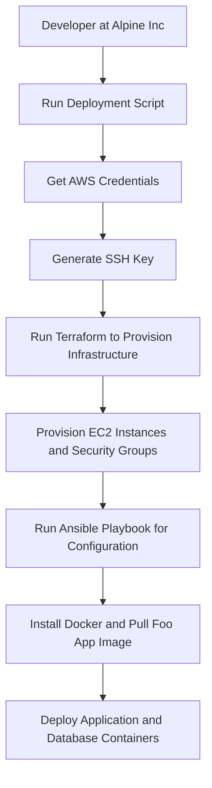

# COSC2759 Assignment 2

## Contributors
- Full Name/Names: George Stergiadis and Kaleb Cole
- Student ID/IDs: s3895662 and s4077402
## Solution design

### Overview
The solution is designed to deploy a web application called Foo App. The application consists of two Docker containers: a web application and a database. The web application is a web page that displays a list of items from a MySQL database.

The solution is deployed on AWS using Terraform and Ansible amd is spun up using a single script (./single-instance-deploy.sh) that automates the deployment process. 

The script will prompt the user for their AWS credentials, generate an SSH key pair, provision the infrastructure using Terraform, configure the infrastructure using Ansible, and deploy the application and database containers.

### Infrastructure

#### Architecture diagram


#### Description of the architecture

1. Get and store AWS credentials
```bash
# input aws credentials
read -p "Enter AWS Access Key ID: " AWS_ACCESS_KEY_ID
read -p "Enter AWS Secret Access Key: " AWS_SECRET_ACCESS_KEY
read -p "Enter AWS Session Token: " AWS_SESSION_TOKEN
read -p "Enter Default Region (default is 'us-east-1'): " AWS_DEFAULT_REGION

# us-east-1 is the default if the user doesn't enter a region
if [ -z "$AWS_DEFAULT_REGION" ]; then
    AWS_DEFAULT_REGION="us-east-1"
fi

# populate the credentials file
cat <<EOL > ~/.aws/credentials
[default]
aws_access_key_id=$AWS_ACCESS_KEY_ID
aws_secret_access_key=$AWS_SECRET_ACCESS_KEY
aws_session_token=$AWS_SESSION_TOKEN
EOL

# populate the config file
cat <<EOL > ~/.aws/config
[default]
region=$AWS_DEFAULT_REGION
EOL
```
    
2. Provision infrastructure using Terraform

3. Configure infrastructure using Ansible


4. Deploy application and database containers


#### Key data flows


### Deployment process

#### Prerequisites

1. You will need to have an AWS account. You can create one [here](https://aws.amazon.com/).
2. You will need the following tools installed on your local machine:
    - [Terraform](https://www.terraform.io/)
    - [Ansible](https://www.ansible.com/)
    - [AWS CLI](https://aws.amazon.com/cli/)
    - [OpenSSH](https://www.openssh.com/)

    

#### Description of the GitHub Actions workflow


#### Backup process: deploying from a shell script




#### Validating that the app is working
<!-- GIF from terminal to opening the EC2 instance by the hostname and then clicking the to the Foos Apps -->


## Contents of this repo

- `README.md`: This file.
- `single-instance-deploy.sh`: A shell script that automates the deployment process.
- `infra/`: A directory containing the Terraform configuration files and SSH key pair.
- `ansible/`: A directory containing the Ansible playbook and MySQL dump file.
- `app/`: A directory containing the Dockerfile and application files for the Foo App.
- `misc/`: A directory containing files given by Alpine Inc. for the deployment proces, as well as the architecture diagram.


