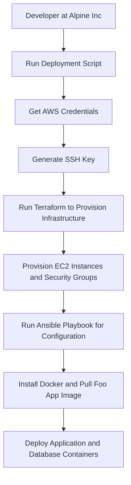

# COSC2759 Assignment 2

## Contributors
- Full Name/Names: George Stergiadis and Kaleb Cole
- Student ID/IDs: s3895662 and s4077402
## Solution design

### Overview
The solution is designed to deploy a web application called Foo App. The application consists of two Docker containers: a web application and a database. The web application is a web page that displays a list of items from a MySQL database.

The solution is deployed on AWS using Terraform and Ansible amd is spun up using a single script (./single-instance-deploy.sh) that automates the deployment process. 

The script will prompt the user for their AWS credentials, generate an SSH key pair, provision the infrastructure using Terraform, configure the infrastructure using Ansible, and deploy the application and database containers.

### Infrastructure

#### Architecture diagram

#### Description of the architecture

1. Shell Script
    - A bash script that automates the necessary steps to deploy the Foo App on AWS.
 
2. Provision infrastructure using Terraform
    - Description of the infrastructure
        - EC2 instance
        - Security group

3. Configure infrastructure using Ansible
    - Description of the configuration
        - Install Docker
        - Pull Foo App image
        - Deploy application and database containers

4. Deploy application and database containers
    - Description of the containers
        - Foo App
        - MySQL database

#### Process Diagram

##### Description of the process diagram
1. The developer runs the deployment script.
2. The script prompts the developer for their AWS credentials.
3. The script generates an SSH key pair.
4. The script uses Terraform to provision the infrastructure.
5. Terraform provisions an EC2 instance and a security group.
6. The script uses Ansible to configure the infrastructure.
7. Ansible installs Docker and pulls the Foo App image.
8. Ansible deploys the application and database containers.

### Deployment process

#### Prerequisites

1. You will need to have an AWS account. You can create one [here](https://aws.amazon.com/).
2. You will need the following tools installed on your local machine:
    - [Terraform](https://www.terraform.io/)
    - [Ansible](https://www.ansible.com/)
    - [AWS CLI](https://aws.amazon.com/cli/)

    
#### Steps to deploy the Foo App

1. Clone the repository.
    - `git clone git@github.com:rmit-sdo-2024-s2/s3895662-s4077402-assignment-2.git`
2. If you are a student using AWS Learning Academy, ensure that you have started the AWS Lab Environment.
3. Run the deployment script.
    - `./single-instance-deploy.sh`
4. Follow the prompts to enter your AWS credentials.
5. Wait for the script to complete.
6. Access the Foo App by navigating to the public IP address of the EC2 instance in your web browser.

<!-- #### Description of the GitHub Actions workflow -->

<!-- #### Backup process: deploying from a shell script -->

#### Validating that the app is working
<!-- GIF from terminal to opening the EC2 instance by the hostname and then clicking the to the Foos Apps -->

## Contents of this repo

- `README.md`: This file.
- `single-instance-deploy.sh`: A shell script that automates the deployment process.
- `infra/`: A directory containing the Terraform configuration files and SSH key pair.
- `ansible/`: A directory containing the Ansible playbook and MySQL dump file.
- `app/`: A directory containing the Dockerfile and application files for the Foo App.
- `misc/`: A directory containing files given by Alpine Inc. for the deployment proces, as well as the architecture diagram.

